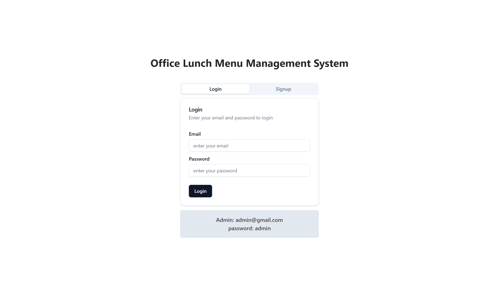
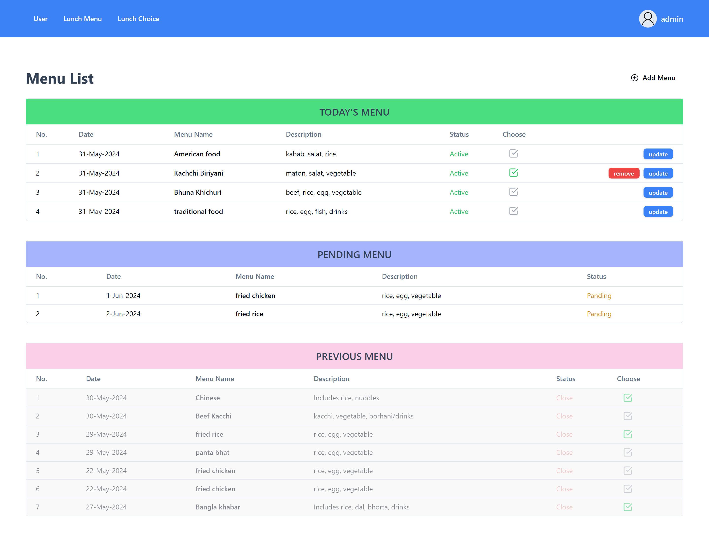
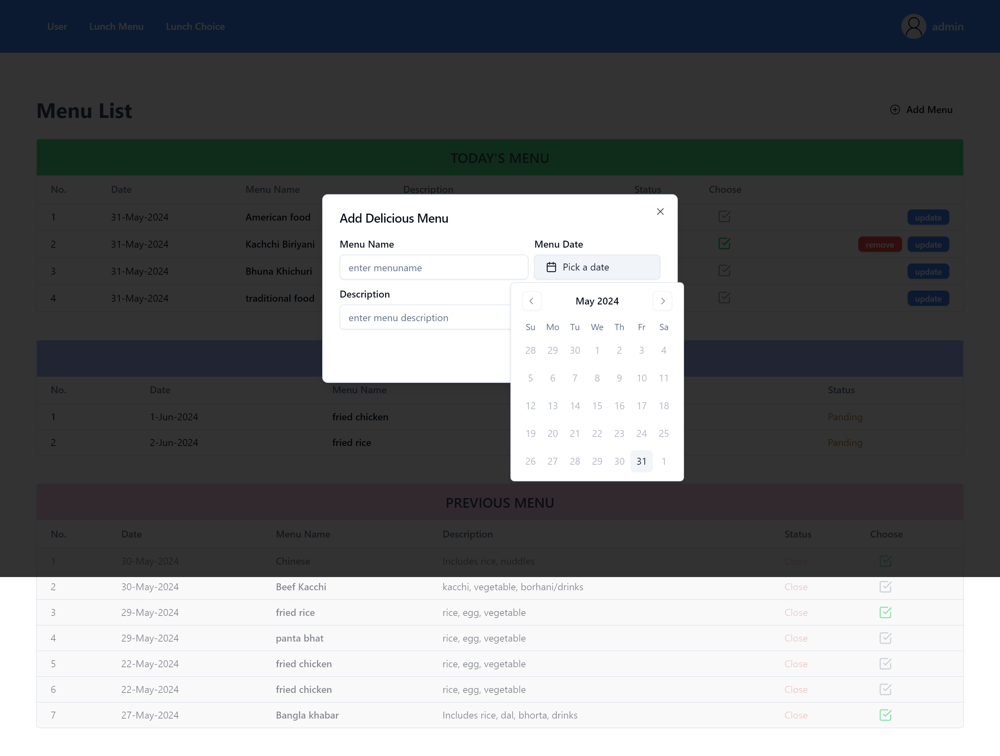
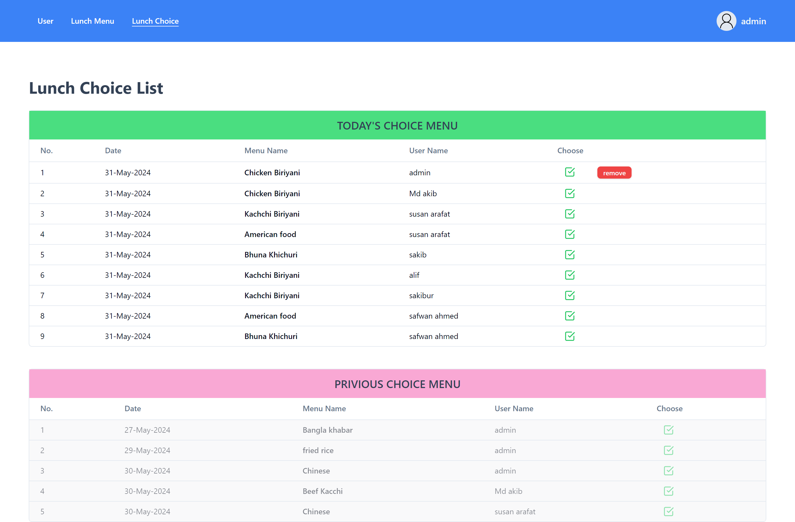
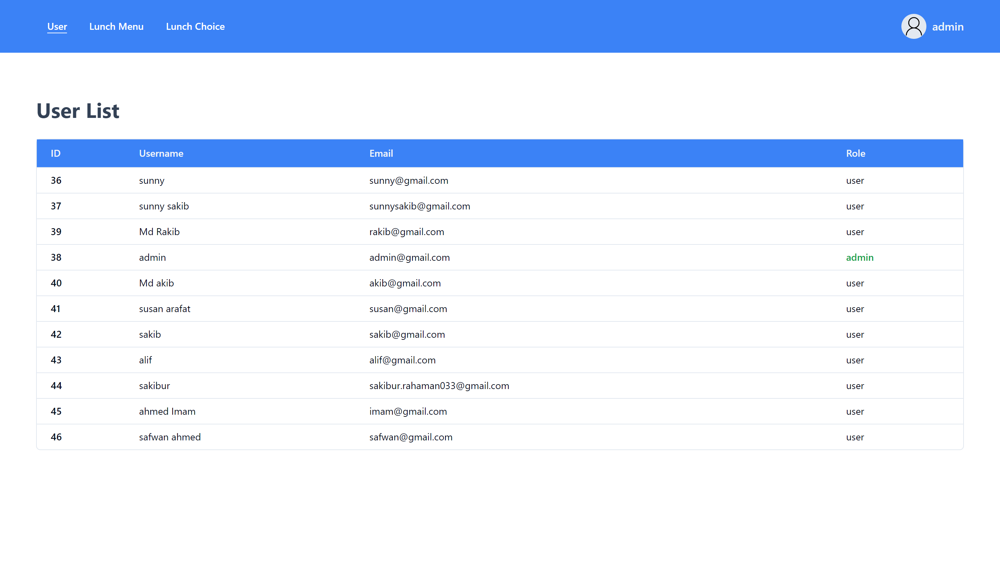

#  Office Lunch Menu Management System Documentation

The Office Lunch Menu Management System is a web application designed to streamline the management of daily lunch options in an office environment. This system allows admins to efficiently add and manage daily lunch menus, while employees can view these menus and select their lunch preferences. The goal is to simplify the lunch ordering process and ensure accurate recording of employees' choices.
## Tech Stack

**Frontend:** React, React Router , TailwindCSS, React Hook Form, Shadcn UI, Day Picker.

**Backend:** Node, Express, Bcrypt, Date-fns, Nodemon.

**Database:** PostgreSQL

## Features

### Admin Interface
- **Add Daily Menu Options:** Admins can add new lunch options for specific dates.
- **View Employee Choices:** Admins can view which employees have chosen which lunch options.
- **View User:** Admins can view user.
### Employee Interface
- **View Daily Menu:** Employees can see the lunch options available for the current day.
- **Select Lunch Choice:** Employees can select their preferred lunch option from the daily menu.

## System Architecture


The system follows a client-server architecture with a clear separation of concerns between the frontend, backend, and database.

Frontend (React.js): Provides the user interface for both admins and employees.
Backend (Node.js with Express.js): Handles API requests, business logic, and communicates with the database.
Database (PostgreSQL): Stores data related to lunch menus, employee choices, and other relevant information.
## Installation

Install my-project with npm

### Backend Setup

1. Clone the repository:

```bash
git clone https://github.com/sunnysakib/office-lunch-menu-management.git
cd office-lunch-menu-management/backend
```

2. Install dependencies:

```bash
npm install
```

3. Set up the PostgreSQL database:

- Upload the database into the pgAdmin 4

4. Configure the database connection:

```
host: "localhost",
user: your_db_username,
port: 5432,
password: your_db_password,
database: lunch_menu_db,

<!-- configure it in src/utils/dbConnect.js -->

```

5. Start the backend server:

```
 npm run dev
 ```
 or
 ```
 npm start

```

### Frontend Setup

1. Navigate to the frontend directory:

```
cd ../frontend
```

2. Install dependencies

```bash
npm install
```

3. Start the frontend development server:
```
npm run dev
```
## User Interface

#### Admin Interface
1. Add Daily Menu Options

- Admins can navigate to the "Add Menu" page, select a date, and enter the lunch options for that date.
- Admins can update the lunch options.
- On submission, the menu is added to the database and can be viewed by employees.

2. View Employee Choices

- Admins can navigate to the "View Choices" page to see a list of employees and their selected lunch options for each date.
#### Employee Interface

1. View Daily Menu

- Employees can navigate to the "Daily Menu" page to see the lunch options available for the current day.

3. Select Lunch Choice

- Employees can select their preferred lunch option from the list of available options.
- On submission, the choice is recorded in the database.


## Conclusion 

This documentation provides an overview of the Office Lunch Menu Management System, including its features, setup instructions, API endpoints, and user interface. For more detailed information, please refer to the project's codebase and inline comments.


## Demo
- Video Drive Link
[Video Demostration](https://drive.google.com/drive/folders/1WZrgBeczMdpKE70oTwUTokdTGCza-fBp?usp=sharing)


## Screenshots
1. Login UI

2. Menu UI

3. Add menu modal

4. lunch choice UI

5. User Table UI

